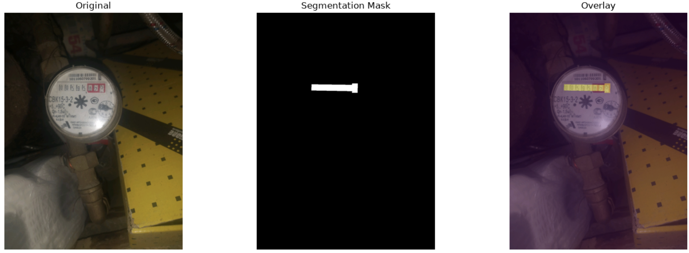
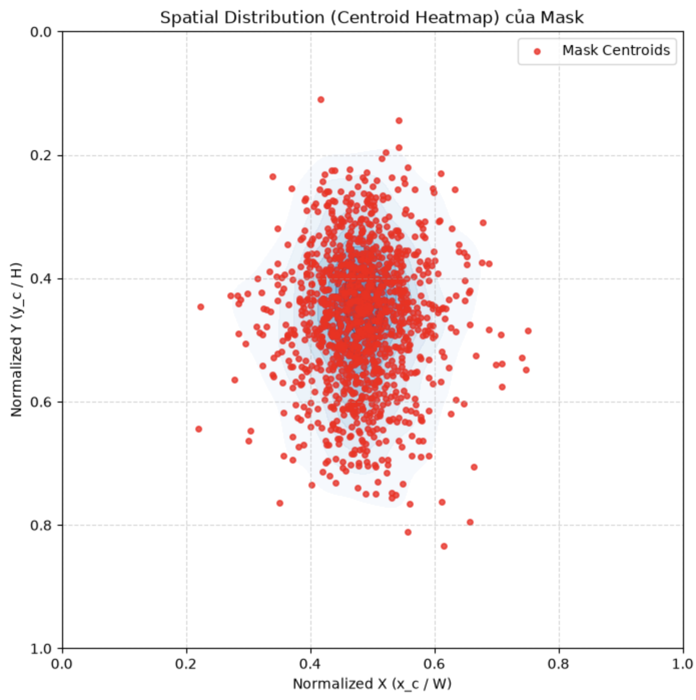
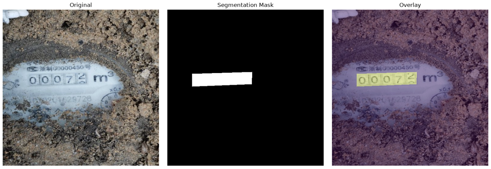
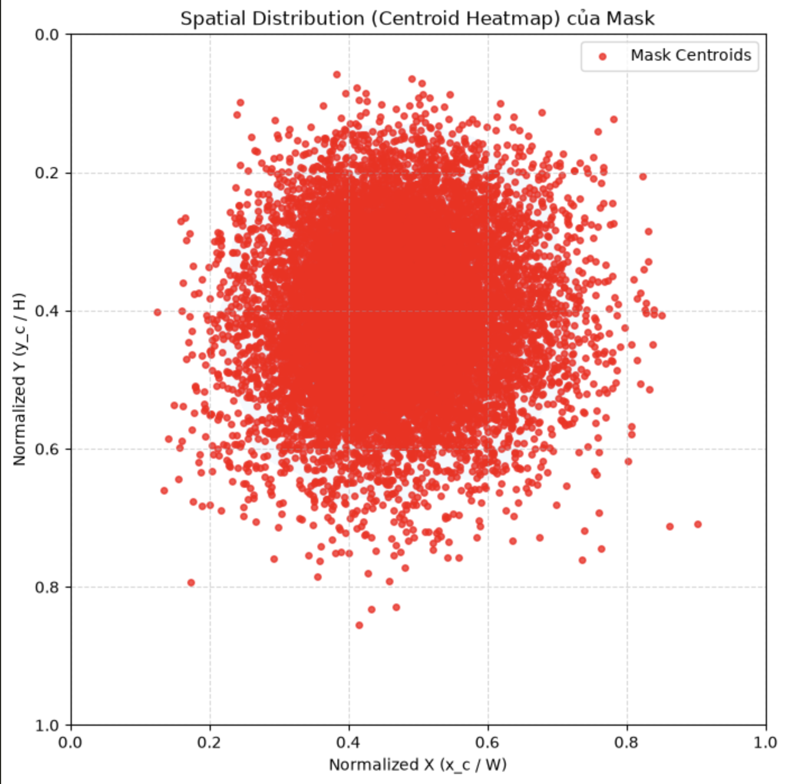
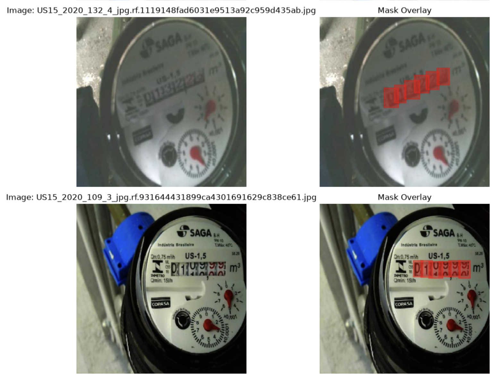
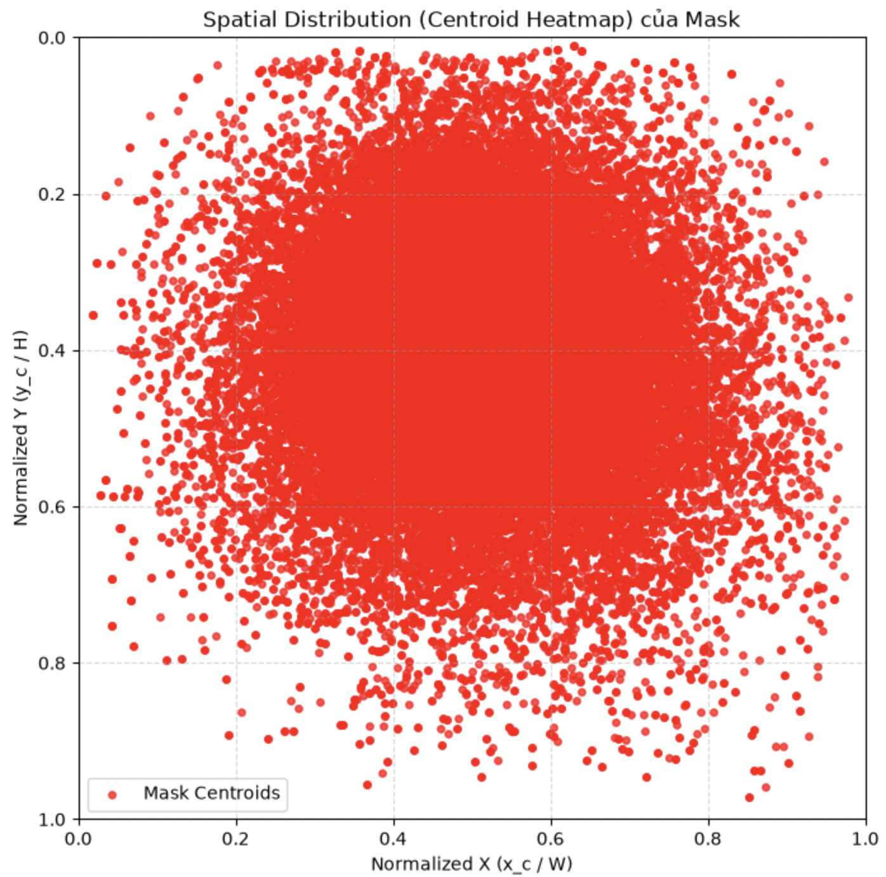
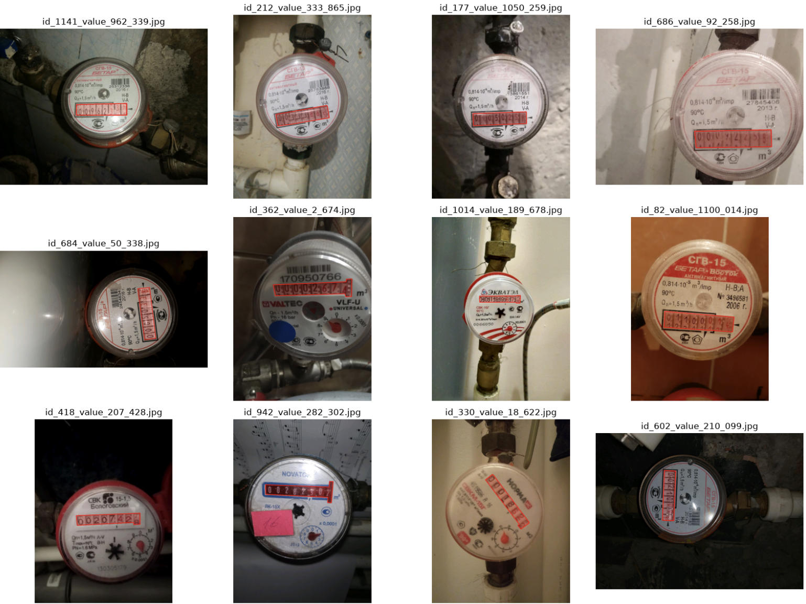
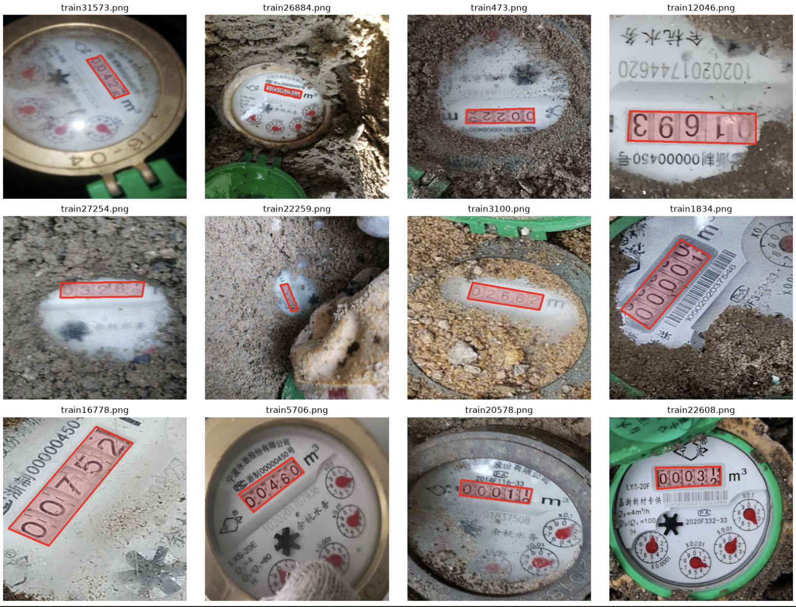
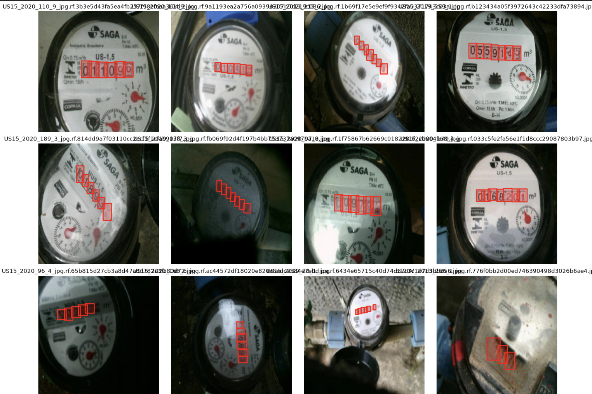

# MeterReadAI — Dataset Processing & EDA

Project này tập trung vào việc xử lý và phân tích các dataset đồng hồ nước (water meters) cho bài toán machine learning. Bao gồm 3 dataset chính với các quy trình EDA, preprocessing và visualization.

## 📊 Tổng quan Dataset

### 1. WaterMeters Dataset
- **Nguồn**: Kaggle (Yandex Toloka Water Meters)
- **Link**: https://www.kaggle.com/datasets/tapakah68/yandextoloka-water-meters-dataset
- **Số lượng**: 1,244 ảnh
- **Phân chia**: Train (995), Val (124), Test (125)
- **Format**: JPEG images + Segmentation masks

### 2. Word-Wheel Water Meter Dataset
- **Nguồn**: Dryad
- **Link**: https://datadryad.org/dataset/doi:10.5061/dryad.7d7wm3860
- **Số lượng**: Train (32,706 → 32,706 sau khi xóa trùng), Test (13,391)
- **Phân chia**: Train (29,436), Val (3,270), Test (13,391)
- **Format**: PNG images + Segmentation masks
- **Lưu ý**: Đã xóa 1 ảnh trùng (train1888.png)

### 3. OCR Water Meter Dataset
- **Nguồn**: Roboflow
- **Link**: https://universe.roboflow.com/traffic-zcg6o/ocr-water-meters/dataset/2
- **Số lượng**: Train (9,273), Val (880), Test (445)
- **Format**: JPEG images + YOLO segmentation labels (polygon format)
- **Tổng polygons**: 57,006 (train), 5,441 (val), 2,731 (test)

## 🔍 Exploratory Data Analysis (EDA)

Các notebook EDA nằm trong thư mục `eda/` để phân tích chất lượng dataset:

### WaterMeters Dataset
- **Notebook**: `eda/check_watermeters.ipynb`
- **Kết quả chính**:
  - Số lượng: 1,244 ảnh, tất cả masks hợp lệ
  - Tỷ lệ mask trung bình: 2.32% diện tích ảnh
  - Format: 100% JPEG
  - Không có ảnh trùng lặp
  - 1 mask chạm biên ảnh
  - Không có lỗi segmentation nghiêm trọng

### Word-Wheel Water Meter Dataset
- **Notebooks**: 
  - `eda/check_word_wheel_water_meter_train_dataset.ipynb`
  - `eda/check_word_wheel_water_meter_test_dataset.ipynb`
- **Kết quả chính**:
  - Train: 32,706 ảnh → 32,706 (đã xóa 1 trùng)
  - Test: 13,391 ảnh
  - Tỷ lệ mask trung bình: 3.78% (train), 3.37% (test)
  - Format: 100% JPEG
  - Đã phát hiện và xóa 1 cặp ảnh trùng: train1873.png, train1888.png
  - Train: 316 masks chạm biên, 1 mask có nhiều vùng rời rạc
  - Test: 128 masks chạm biên, 1 mask có nhiều vùng rời rạc

### OCR Water Meter Dataset
- **Notebooks**:
  - `eda/check_ocr_water_meter_train.ipynb`
  - `eda/check_ocr_water_meter_valid.ipynb`
  - `eda/check_ocr_water_meter_test.ipynb`
- **Kết quả chính**:
  - Train: 9,273 ảnh, 57,006 polygons hợp lệ
  - Val: 880 ảnh, 5,441 polygons hợp lệ
  - Test: 445 ảnh, 2,731 polygons hợp lệ
  - Tỷ lệ mask trung bình: 5.78% (train), 5.77% (val), 5.65% (test)
  - Format: 100% JPEG
  - Không có ảnh trùng lặp
  - Không có label không hợp lệ

## 🛠️ Data Preprocessing

Các notebook preprocessing nằm trong thư mục `preprocessing_data/` để chuẩn bị dữ liệu cho training:

### WaterMeters Dataset
- **Notebook**: `preprocessing_data/water_meters.ipynb`
- **Các bước**:
  1. Chuyển đổi segmentation masks thành YOLO polygon format
  2. Phân chia dataset thành train/val/test theo tỷ lệ 80/10/10
  3. Copy dữ liệu vào cấu trúc YOLO format

### Word-Wheel Water Meter Dataset
- **Notebook**: `preprocessing_data/word_wheel_water_meter.ipynb`
- **Các bước**:
  1. Xóa ảnh trùng lặp (train1888.png và mask tương ứng)
  2. Kiểm tra và xác nhận không còn trùng lặp giữa train và test
  3. Chuyển đổi segmentation masks thành YOLO polygon format cho cả train và test
  4. Visualize kết quả chuyển đổi

## 🎨 Dataset Visualization

Các notebook visualization nằm trong thư mục `visualize_dataset/` để hiển thị trực quan dữ liệu đã xử lý:

### WaterMeters Dataset
- **Notebook**: `visualize_dataset/visualize_water_meters.ipynb`
- **Kết quả**: Hiển thị 12 ảnh ngẫu nhiên từ mỗi split (train/val/test) với polygon overlay

### Word-Wheel Water Meter Dataset
- **Notebook**: `visualize_dataset/visualize_word_wheel_meter.ipynb`
- **Kết quả**: Hiển thị 12 ảnh ngẫu nhiên từ mỗi split (train/val/test) với polygon overlay

### OCR Water Meter Dataset
- **Notebook**: `visualize_dataset/ocr_water_meter.ipynb`
- **Kết quả**: Hiển thị 12 ảnh ngẫu nhiên từ mỗi split (train/val/test) với polygon overlay

## 📈 Kết quả EDA chính

### Chất lượng dataset
- **WaterMeters**: Dữ liệu chất lượng cao, không có lỗi nghiêm trọng
- **Word-Wheel**: Dữ liệu tốt, đã xử lý trùng lặp, một số masks chạm biên
- **OCR Water Meter**: Dữ liệu rất tốt, tất cả labels hợp lệ, không có trùng lặp

### Phân bố mask
- WaterMeters: 2.32% (trung bình)
- Word-Wheel: 3.78% (train), 3.37% (test)
- OCR Water Meter: 5.78% (train), 5.77% (val), 5.65% (test)

### Data leakage
- Không có trùng lặp giữa train và test ở cả 3 dataset
- Đã xóa 1 cặp ảnh trùng trong Word-Wheel train set

## 📝 Lưu ý
- Dataset dùng để test: https://drive.google.com/drive/u/0/folders/18UMXLWPYnHTnGbjmwSutPuWjKZCHdXMW
- Tất cả dataset đã được chuyển sang YOLO format polygon
- Cấu trúc dữ liệu tuân theo chuẩn YOLO: images/ và labels/ cho mỗi split (train/val/test)
