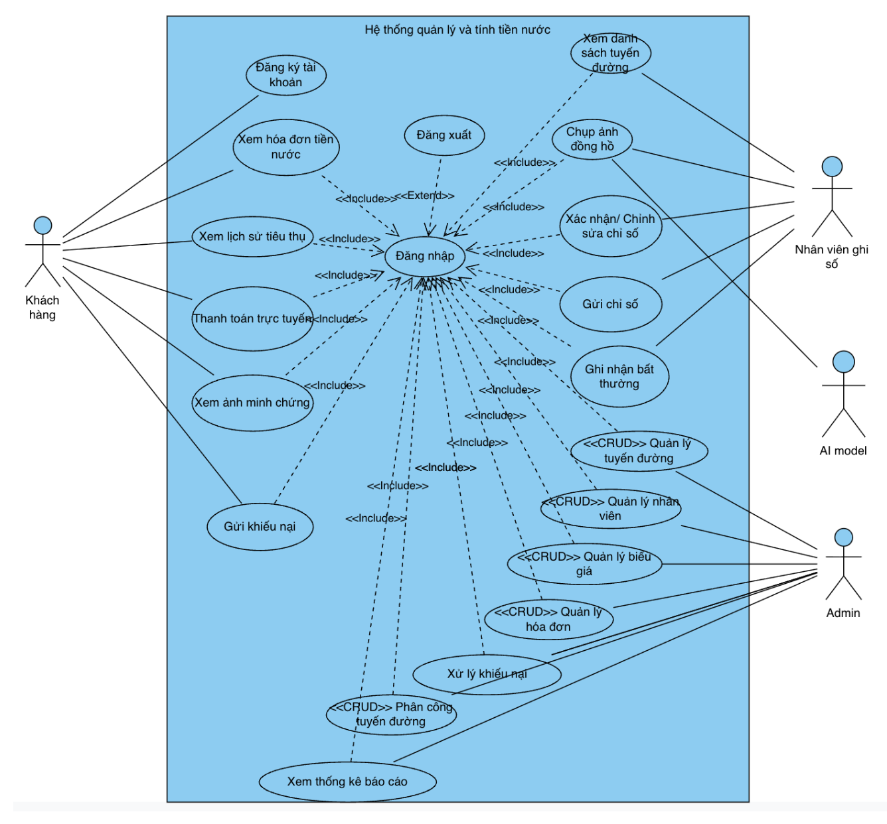
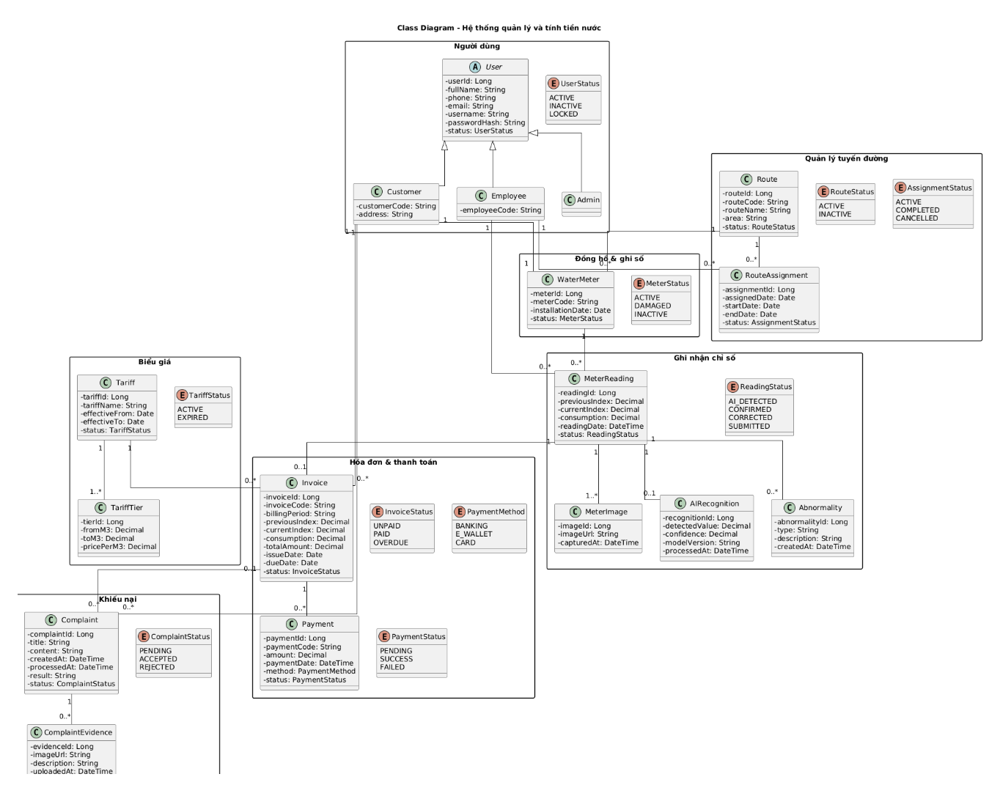
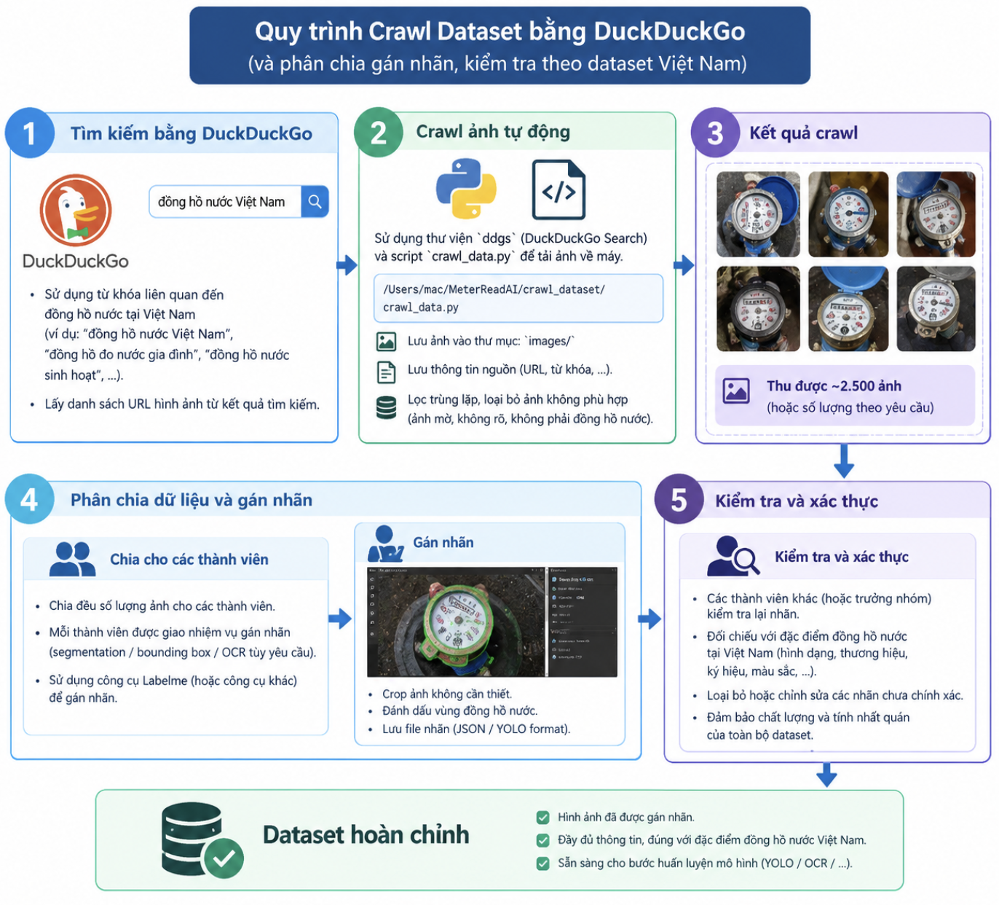
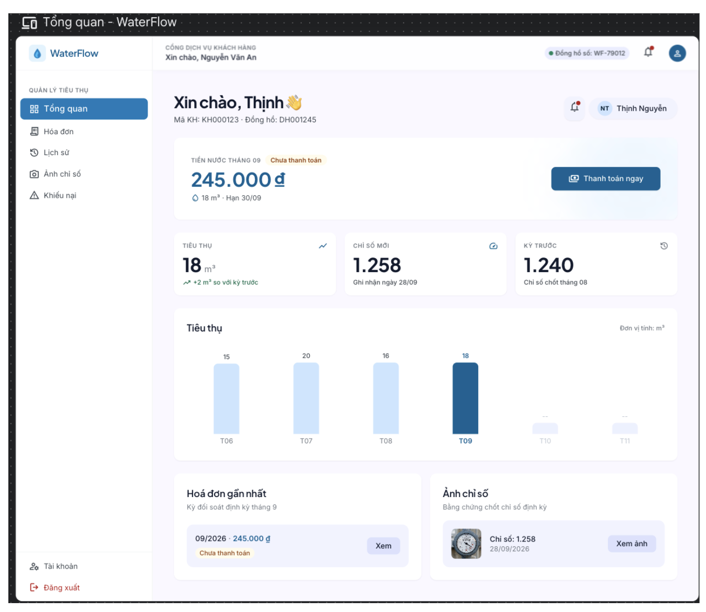
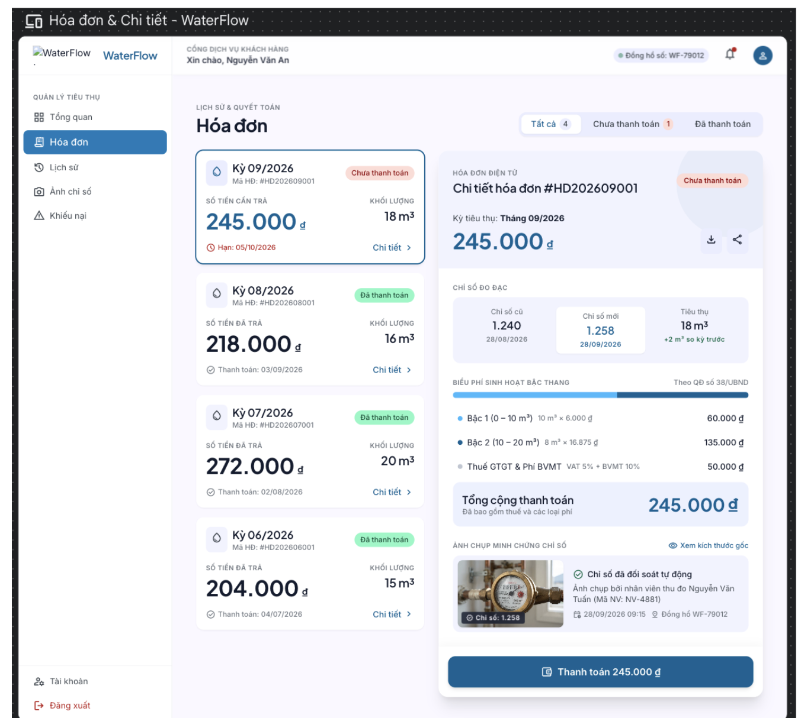
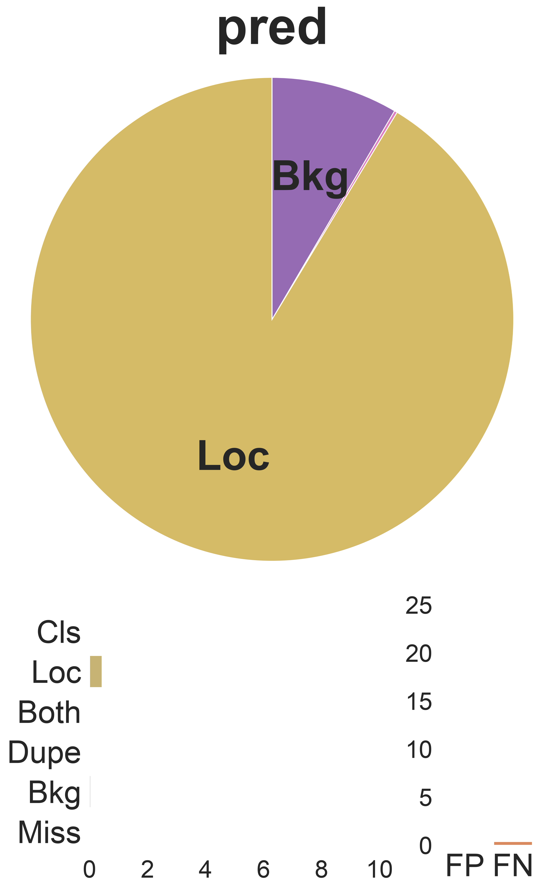
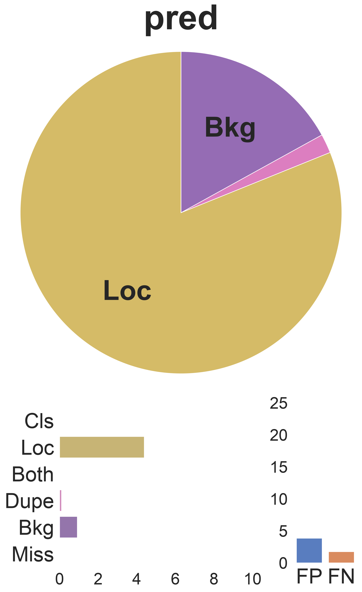
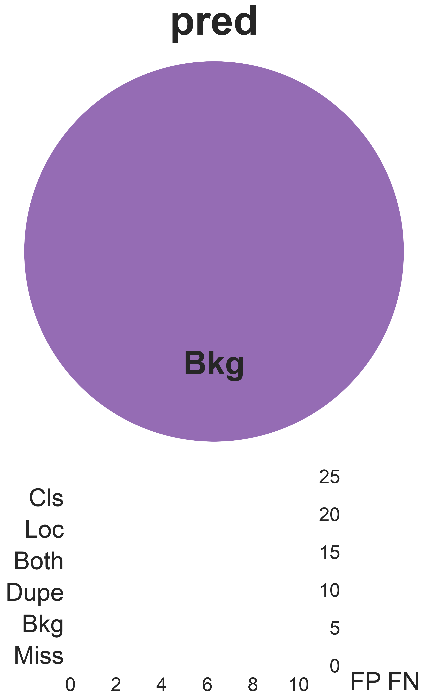
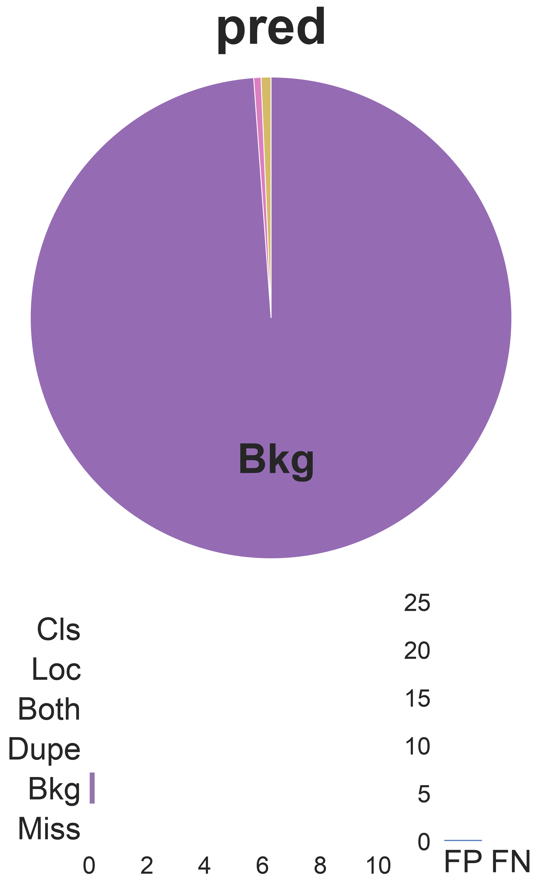

# MeterReadAI — Hệ Thống Đọc Chỉ Số Đồng Hồ Nước & Quản Lý Tính Tiền Nước Tự Động

**MeterReadAI** là giải pháp toàn diện kết hợp công nghệ **Thị giác Máy tính (Deep Learning / YOLO Instance Segmentation & OCR)** với **Hệ thống Quản lý & Tính tiền nước thông minh (WaterFlow)**. Dự án giải quyết trọn vẹn từ bài toán tự động nhận diện chỉ số đồng hồ thực tế tại Việt Nam đến quy trình quản trị tuyến đọc, tính toán hóa đơn bậc thang và cổng tra cứu minh bạch cho khách hàng.

---

## 📑 Mục lục
- [1. 🏗️ Kiến trúc & Thiết kế Hệ thống (System Design)](#1-️-kiến-trúc--thiết-kế-hệ-thống-system-design)
  - [1.1. Sơ đồ Ca sử dụng (Use Case Diagram)](#11-sơ-đồ-ca-sử-dụng-use-case-diagram)
  - [1.2. Sơ đồ Lớp (Class Diagram)](#12-sơ-đồ-lớp-class-diagram)
- [2. 🌐 Quy trình Thu thập & Gán nhãn Dữ liệu (Crawl & Labeling Pipeline)](#2--quy-trình-thu-thập--gán-nhãn-dữ-liệu-crawl--labeling-pipeline)
- [3. 📱 Thiết kế Giao diện Người dùng (UI/UX Wireframes)](#3--thiết-kế-giao-diện-người-dùng-uiux-wireframes)
- [4. 📊 Tổng quan Dataset](#4--tổng-quan-dataset)
- [5. 🔍 Khám phá & Đánh giá Dữ liệu (EDA)](#5--khám-phá--đánh-giá-dữ-liệu-eda)
- [6. 🛠️ Tiền xử lý & Trực quan hóa Dữ liệu](#6-️-tiền-xử-lý--trực-quan-hóa-dữ-liệu)
- [7. 🏆 Báo cáo Kết quả Đánh giá Mô hình (Baseline Models)](#7--báo-cáo-kết-quả-đánh-giá-mô-hình-baseline-models)
- [8. 🔬 Phân tích Lỗi Chuyên sâu (Error Analysis)](#8--phân-tích-lỗi-chuyên-sâu-error-analysis)
- [9. 📝 Ghi chú & Tài nguyên](#9--ghi-chú--tài-nguyên)

---

## 1. 🏗️ Kiến trúc & Thiết kế Hệ thống (System Design)

Hệ thống được thiết kế hướng dịch vụ nhằm phục vụ 3 nhóm tác nhân chính: **Khách hàng (Customer)**, **Nhân viên ghi số (Meter Reader / Employee)**, **Quản trị viên (Admin)** cùng với **AI Model Engine**.

### 1.1. Sơ đồ Ca sử dụng (Use Case Diagram)

Hệ thống phân định rõ vai trò và luồng tương tác giữa các tác nhân:
- **Khách hàng**: Đăng ký/Đăng nhập, xem hóa đơn tiền nước, xem lịch sử tiêu thụ theo tháng, thanh toán trực tuyến, xem ảnh minh chứng chụp từ đồng hồ thực tế, gửi khiếu nại.
- **Nhân viên ghi số**: Xem danh sách tuyến đường được phân công, chụp ảnh đồng hồ tại hiện trường, nhận kết quả nhận diện tự động từ AI, xác nhận/chỉnh sửa chỉ số, ghi nhận bất thường (bể vỡ, mờ số, gian lận).
- **AI Model**: Tự động nhận diện vùng mặt số (Segmentation) và đọc chỉ số (OCR) từ ảnh hiện trường với độ tin cậy (*confidence score*).
- **Admin**: Quản lý tuyến đường, quản lý nhân viên & phân công tuyến, cấu hình biểu giá bậc thang, quản lý hóa đơn, giải quyết khiếu nại, xem thống kê báo cáo doanh thu & sản lượng.

<p align="center">
  
</p>
<p align="center">
  <em>Hình 1: Sơ đồ Use Case tổng thể của Hệ thống Quản lý và Tính tiền nước</em>
</p>

---

### 1.2. Sơ đồ Lớp (Class Diagram)

Cấu trúc dữ liệu và thực thể nghiệp vụ được mô hình hóa chặt chẽ theo các module:
- **Module Người dùng**: `User` (lớp cha kế thừa cho `Customer`, `Employee`, `Admin`) cùng trạng thái `UserStatus`.
- **Module Tuyến đường & Phân công**: `Route`, `RouteAssignment` liên kết nhân viên với danh sách đồng hồ trên từng địa bàn.
- **Module Đồng hồ & Ghi nhận chỉ số**: `WaterMeter`, `MeterReading`, `MeterImage`, `AIRecognition` (lưu giá trị detect, confidence, version), `Abnormality` (ghi nhận bất thường).
- **Module Hóa đơn & Biểu giá**: `Tariff`, `TariffTier` (áp dụng biểu giá sinh hoạt/kinh doanh theo bậc thang $m^3$), `Invoice`, `Payment`.
- **Module Khiếu nại**: `Complaint`, `ComplaintEvidence`.

<p align="center">
  
</p>
<p align="center">
  <em>Hình 2: Sơ đồ Class Diagram chi tiết các thực thể trong hệ thống</em>
</p>

---

## 2. 🌐 Quy trình Thu thập & Gán nhãn Dữ liệu (Crawl & Labeling Pipeline)

Để đảm bảo mô hình AI hoạt động chính xác trong điều kiện thực tế tại Việt Nam, quy trình thu thập dữ liệu được xây dựng bài bản gồm 5 bước khép kín:

```text
[1. Tìm kiếm DuckDuckGo] ➔ [2. Crawl ảnh tự động] ➔ [3. Lưu trữ & Lọc ảnh (~2.500 ảnh)] ➔ [4. Phân chia & Gán nhãn Labelme] ➔ [5. Cross-Check & Xác thực] ➔ [Dataset Hoàn chỉnh]
```

1. **Tìm kiếm bằng DuckDuckGo Search**: Xây dựng bộ từ khóa đa dạng:
   - *Thương hiệu phổ biến VN*: Asahi, Zenner, Sanwa, Minh Hòa, Komax, Itron, T-Flow, Merlion, Unik.
   - *Mặt số & cấu tạo*: Mặt số bánh răng, mặt kính mờ, cơ học.
   - *Môi trường / Nhiễu thực tế*: Đồng hồ bị bám bùn đất, rỉ sét, đọng nước mặt kính, trầy xước, chôn dưới đất, thiếu sáng.
2. **Crawl ảnh tự động**: Sử dụng script [`crawl_dataset/crawl_data.py`](crawl_dataset/crawl_data.py) với thư viện `ddgs`, tự động tải ảnh chất lượng, kiểm tra kích thước tối thiểu và loại bỏ ảnh lỗi.
3. **Kết quả crawl**: Thu thập ~2.500+ ảnh phản ánh đúng hiện trạng đồng hồ nước tại Việt Nam.
4. **Phân chia & Gán nhãn**: Phân bổ đều cho các thành viên trong nhóm, sử dụng công cụ **Labelme** để vẽ polygon chi tiết cho vùng mặt số và từng chữ số OCR.
5. **Kiểm tra & Xác thực chéo (Cross-check)**: Rà soát độ chính xác của nhãn, chuẩn hóa nhãn lỗi, loại bỏ nhiễu và xuất ra chuẩn YOLO Segmentation / JSON.

<p align="center">
  
</p>
<p align="center">
  <em>Hình 3: Quy trình 5 bước thu thập, lọc và gán nhãn dataset đồng hồ nước Việt Nam</em>
</p>

---

## 3. 📱 Thiết kế Giao diện Người dùng (UI/UX Wireframes)

Giao diện cổng dịch vụ khách hàng (**WaterFlow**) được thiết kế theo phong cách hiện đại, trực quan và minh bạch thông tin:

### 3.1. Dashboard Tổng quan Khách hàng
- Hiển thị thông tin mã khách hàng, mã đồng hồ, số tiền cần thanh toán trong kỳ.
- Thống kê sản lượng tiêu thụ ($m^3$) so sánh với kỳ trước.
- Biểu đồ cột trực quan hóa mức tiêu thụ nước theo các tháng liên tiếp.
- Xem nhanh hóa đơn gần nhất và ảnh chụp đồng hồ đối soát chỉ số.

<p align="center">
  
</p>
<p align="center">
  <em>Hình 4: Giao diện Trang chủ / Tổng quan tiêu thụ của Khách hàng</em>
</p>

---

### 3.2. Chi tiết Hóa đơn & Bằng chứng Đối soát Minh bạch
- Liệt kê danh sách hóa đơn theo kỳ (kèm trạng thái *Đã thanh toán / Chưa thanh toán*).
- Chi tiết cách tính tiền theo từng bậc thang sinh hoạt (Bậc 1: $0-10 m^3$, Bậc 2: $10-20 m^3$, Thuế GTGT & Phí BVMT).
- **Tính năng minh bạch cốt lõi**: Khách hàng được xem trực tiếp **Ảnh chụp minh chứng chỉ số** kèm thông tin nhân viên ghi số, thời gian chụp thực tế và kết quả đối soát tự động từ AI.

<p align="center">
  
</p>
<p align="center">
  <em>Hình 5: Giao diện Chi tiết hóa đơn, biểu phí bậc thang và ảnh chụp đối soát</em>
</p>

---

## 4. 📊 Tổng quan Dataset

Dự án sử dụng kết hợp 3 bộ dữ liệu đồng hồ nước đa dạng:

| Dataset | Nguồn | Số lượng ảnh | Phân chia (Train / Val / Test) | Định dạng nhãn |
| :--- | :--- | :--- | :--- | :--- |
| **WaterMeters (D3)** | [Kaggle - Yandex Toloka](https://www.kaggle.com/datasets/tapakah68/yandextoloka-water-meters-dataset) | 1,244 | 995 / 124 / 125 | JPEG + Segmentation masks |
| **Word-Wheel (D2)** | [Dryad](https://datadryad.org/dataset/doi:10.5061/dryad.7d7wm3860) | 46,097 *(gốc: 46,098)* | 29,436 / 3,270 / 13,391 | PNG → JPEG + Segmentation masks |
| **OCR Water Meter (D4)** | [Roboflow Universe](https://universe.roboflow.com/traffic-zcg6o/ocr-water-meters/dataset/2) | 10,598 | 9,273 / 880 / 445 | JPEG + YOLO polygon labels |
| **Merge-Dataset (D1)** | *Kết hợp D2 + D3 + D4* | **57,939** | **39,704 / 4,274 / 13,961** | YOLO polygon format (16,247 test instances) |

---

## 5. 🔍 Khám phá & Đánh giá Dữ liệu (EDA)

Các phân tích được thực hiện tại thư mục [`eda/`](eda/):

### 5.1. WaterMeters Dataset
- **Notebook**: [`eda/check_watermeters.ipynb`](eda/check_watermeters.ipynb)
- **Đặc trưng**: 1,244 ảnh, tỷ lệ mask trung bình chiếm **2.32%** diện tích ảnh. Không có ảnh trùng lặp, chỉ 1 mask chạm biên.

<p align="center">
  
  
</p>

---

### 5.2. Word-Wheel Water Meter Dataset
- **Notebooks**: [`eda/check_word_wheel_water_meter_train_dataset.ipynb`](eda/check_word_wheel_water_meter_train_dataset.ipynb), [`eda/check_word_wheel_water_meter_test_dataset.ipynb`](eda/check_word_wheel_water_meter_test_dataset.ipynb)
- **Đặc trưng**: Tỷ lệ mask trung bình **3.78%** (Train) và **3.37%** (Test).
- **Làm sạch**: Phát hiện và loại bỏ cặp ảnh trùng lặp (`train1873.png` & `train1888.png`).

<p align="center">
  
  
</p>

---

### 5.3. OCR Water Meter Dataset
- **Notebooks**: [`eda/check_ocr_water_meter_train.ipynb`](eda/check_ocr_water_meter_train.ipynb), [`eda/check_ocr_water_meter_valid.ipynb`](eda/check_ocr_water_meter_valid.ipynb), [`eda/check_ocr_water_meter_test.ipynb`](eda/check_ocr_water_meter_test.ipynb)
- **Đặc trưng**: Tỷ lệ polygon mask trung bình **5.78%** (Train), **5.77%** (Val), **5.65%** (Test) với hơn 65,178 polygons chữ số/mặt số nhỏ.

<p align="center">
  
  
</p>

---

## 6. 🛠️ Tiền xử lý & Trực quan hóa Dữ liệu

### 6.1. Tiền xử lý (Preprocessing)
Toàn bộ script nằm trong thư mục [`preprocessing_data/`](preprocessing_data/):
1. **Chuẩn hóa nhãn về YOLO Polygon**: Chuyển binary mask thành tọa độ normalized polygon `(cls x1 y1 x2 y2 ... xn yn)`.
2. **Chia tập dữ liệu chuẩn**: Phân chia theo tỷ lệ 80% Train, 10% Val, 10% Test, cam kết không bị **Data Leakage**.
3. **Cấu trúc chuẩn YOLO**:
   ```text
   dataset_root/
   ├── images/ (train / val / test)
   └── labels/ (train / val / test)
   ```

### 6.2. Trực quan hóa (Visualization)

<p align="center">
  <b>WaterMeters Dataset</b><br/>
  
</p>

<p align="center">
  <b>Word-Wheel Water Meter Dataset</b><br/>
  
</p>

<p align="center">
  <b>OCR Water Meter Dataset</b><br/>
  
</p>

---

## 7. 🏆 Báo cáo Kết quả Đánh giá Mô hình (Baseline Models)

Các mô hình Instance Segmentation được huấn luyện và đánh giá trên phần cứng **GPU NVIDIA Tesla T4** với 4 kịch bản dữ liệu:
- **D1 (merge-dataset)**: Tập kiểm thử tổng hợp (13,961 ảnh, 16,247 instances)
- **D2 (word-wheel-water-meter)**: 13,391 ảnh
- **D3 (water-meters)**: 125 ảnh
- **D4 (ocr-water-meter)**: 445 ảnh, 2,731 instances

### 📊 Bảng tổng hợp hiệu năng

| Phụ trách | Model | Dataset | Layers | Params | GFLOPs | Box mAP50 | Box mAP50-95 | Mask mAP50 | Mask mAP50-95 | F1-Score | FPS (T4) |
| :--- | :--- | :--- | :---: | :---: | :---: | :---: | :---: | :---: | :---: | :---: | :---: |
| **Gia Thịnh** | **YOLO26n-seg** | **D1 (Merge)** | 136 | 2.69M | 9.1 | **0.994** | **0.780** | **0.983** | **0.686** | **0.9944** | **139.85** |
| | | D2 | 139 | 2.69M | 9.1 | 0.995 | 0.816 | 0.995 | 0.743 | 0.9975 | 143.47 |
| | | D3 | 139 | 2.69M | 9.1 | 0.988 | 0.940 | 0.988 | 0.869 | 0.9616 | 77.15 |
| | | D4 | 139 | 2.69M | 9.1 | 0.984 | 0.576 | 0.842 | 0.316 | 0.9576 | 115.16 |
| **Quang Hưng** | **YOLO12n-seg** | **D1 (Merge)** | 172 | 2.81M | 10.6 | **0.995** | **0.778** | **0.983** | **0.684** | **0.9936** | **106.50** |
| | | D2 | 172 | 2.81M | 10.6 | 0.995 | 0.812 | 0.995 | 0.741 | 0.9995 | 104.56 |
| | | D3 | 172 | 2.81M | 10.6 | 0.995 | 0.847 | 0.995 | 0.834 | 0.9944 | 63.84 |
| | | D4 | 172 | 2.81M | 10.6 | 0.985 | 0.570 | 0.833 | 0.306 | 0.9693 | 84.60 |
| **Bảo Duy** | **YOLO11n-seg** | **D1 (Merge)** | 114 | 2.83M | 9.6 | **0.995** | **0.784** | **0.983** | **0.690** | **0.9939** | **144.25** |
| | | D2 | 114 | 2.83M | 9.6 | 0.995 | 0.813 | 0.995 | 0.743 | 0.9997 | 143.40 |
| | | D3 | 114 | 2.83M | 9.6 | 0.995 | 0.947 | 0.995 | 0.887 | 0.9943 | 75.63 |
| | | D4 | 114 | 2.83M | 9.6 | 0.985 | 0.578 | 0.827 | 0.311 | 0.9699 | 108.67 |
| **Nguyên Khánh**| **YOLOv8n-seg** | **D1 (Merge)** | 86 | 3.26M | 11.3 | **0.995** | **0.781** | **0.983** | **0.684** | **0.9942** | **144.21** |
| | | D2 | 86 | 3.26M | 11.3 | 0.995 | 0.812 | 0.995 | 0.741 | 0.9997 | 145.58 |
| | | D3 | 86 | 3.26M | 11.3 | 0.995 | 0.923 | 0.995 | 0.879 | 0.9956 | 88.61 |
| | | D4 | 86 | 3.26M | 11.3 | 0.984 | 0.566 | 0.835 | 0.314 | 0.9691 | 104.62 |
| **Công Hùng** | **YOLOE-26n-seg**| **D1 (Merge)** | 143 | 2.69M | 9.1 | 0.994 | 0.782 | 0.983 | 0.684 | 0.9880 | **151.58** |
| | | D2 | 164 | 4.90M | 9.7 | 0.247 | 0.115 | 0.263 | 0.130 | 0.3416 | 141.05 |
| | | D3 | 164 | 4.90M | 9.7 | 0.215 | 0.165 | 0.216 | 0.158 | 0.2971 | 74.32 |
| | | D4 | 164 | 4.90M | 9.7 | 0.031 | 0.013 | 0.023 | 0.007 | 0.0868 | 115.00 |
| **Đăng Khoa** | **YOLOE-11s-seg**| **D1 (Merge)** | 139 | 13.69M | 34.0 | 0.401 | 0.282 | 0.392 | 0.265 | 0.4195 | 53.49 |
| | | D2 | 139 | 13.69M | 34.0 | 0.645 | 0.469 | 0.640 | 0.422 | 0.6298 | 61.17 |
| | | D3 | 139 | 13.69M | 34.0 | 0.798 | 0.533 | 0.806 | 0.515 | 0.8212 | 55.56 |
| | | D4 | 139 | 13.69M | 34.0 | 0.430 | 0.218 | 0.328 | 0.115 | 0.4575 | 44.60 |
| **Quốc Anh** | **YOLOE-v8s-seg**| **D1 (Merge)** | 111 | 15.41M | 41.0 | 0.296 | 0.230 | 0.293 | 0.210 | 0.4068 | 57.44 |
| | | D2 | 111 | 15.41M | 41.0 | 0.449 | 0.318 | 0.459 | 0.310 | 0.4875 | 60.53 |
| | | D3 | 111 | 15.41M | 41.0 | 0.730 | 0.674 | 0.730 | 0.651 | 0.7272 | 43.07 |
| | | D4 | 111 | 15.41M | 41.0 | 0.116 | 0.059 | 0.091 | 0.031 | 0.2279 | 52.25 |

### 💡 Nhận xét chính
1. **Nhóm mô hình dẫn đầu**: **YOLO26n-seg**, **YOLO11n-seg**, **YOLO12n-seg** và **YOLOv8n-seg** đạt độ chính xác cao trên tập kiểm thử tổng hợp D1:
   - **Box mAP50**: ~99.4% - 99.5%
   - **Mask mAP50**: ~98.3%
   - **F1-Score**: Đạt ~0.994
   - **Tốc độ inference**: Rất nhanh (106 - 144 FPS trên GPU T4, độ trễ ~4.9 - 7.3 ms/ảnh).
2. **Thử nghiệm mở rộng (YOLOE variants)**: Các kiến trúc YOLOE khi fine-tune cần số lượng epoch hoặc hyperparameter tuning kỹ hơn trên các tập nhỏ như D4 (OCR).

---

## 8. 🔬 Phân tích Lỗi Chuyên sâu (Error Analysis)

Thông qua phân tích ma trận lỗi dự đoán (Prediction Error Matrix & False Negative / False Positive Breakdown), các loại lỗi chính được định lượng như sau:

- **Bkg (Background Error)**: Dự đoán nhầm vùng nền thành đối tượng hoặc đối tượng dự đoán bị gán nhãn thành nền.
- **Loc (Localization Error)**: Phát hiện đúng nhãn lớp nhưng sai lệch tọa độ boundary / mask polygon ($IoU < Threshold$).
- **Cls (Classification Error)**: Định vị đúng vùng đối tượng nhưng phân loại sai nhãn lớp.
- **Dupe (Duplicate Detection)**: Dự đoán dư thừa / trùng lặp do NMS chưa triệt tiêu hoàn toàn.
- **Miss (Missed / False Negative)**: Bỏ sót hoàn toàn đối tượng ground truth.
- **FP / FN**: Tỷ lệ tổng quát giữa **False Positive** (dương tính giả) và **False Negative** (âm tính giả).

---

### 8.1. Biểu đồ Phân tích Lỗi trên các Dataset

<p align="center">
  
  
</p>
<p align="center">
  <em>Hình 6: Phân tích lỗi trên <b>Merge Dataset (D1)</b> (trái) và <b>OCR Water Meter Dataset (D4)</b> (phải)</em>
</p>

<p align="center">
  
  
</p>
<p align="center">
  <em>Hình 7: Phân tích lỗi trên <b>Water Meters Dataset (D3)</b> (trái) và <b>Word-Wheel Dataset (D2)</b> (phải)</em>
</p>

---

### 8.2. Đánh giá & Rút ra Giải pháp

1. **Trên Dataset OCR Water Meter (D4) & Merge Dataset (D1)**:
   - **Lỗi Localization (Loc)** chiếm tỷ trọng cao nhất trong các ca lỗi do ký tự chữ số rất nhỏ và san sát nhau.
   - **Lỗi Background (Bkg) & False Negatives (FN)**: Thường xuất hiện ở ảnh thiếu sáng, chói lóa trên mặt kính hoặc chữ số bị bám bụi bẩn.
2. **Trên Dataset Water Meters (D3) & Word-Wheel (D2)**:
   - Tỷ lệ lỗi cực kỳ thấp. Lỗi chủ yếu nằm ở một lượng rất nhỏ **Background (Bkg)** tại các viền kim loại / mặt viền tròn của đồng hồ do độ tương phản không đồng đều.
3. **Định hướng cải thiện**:
   - Áp dụng kỹ thuật **Data Augmentation** chuyên sâu: đổi độ sáng ngẫu nhiên, mô phỏng phản xạ lóa sáng (Glare simulation), làm mờ nhẹ (Gaussian blur).
   - Tinh chỉnh loss weight cho phần Segmentation Mask Loss và tối ưu ngưỡng $IoU$ trong NMS để giảm thiểu lỗi Localization đối với các ký tự chữ số nhỏ.

---

## 9. 📝 Ghi chú & Tài nguyên

- **Dữ liệu kiểm thử (Drive)**: [Google Drive Link](https://drive.google.com/drive/u/0/folders/18UMXLWPYnHTnGbjmwSutPuWjKZCHdXMW)
- **Chuẩn nhãn**: 100% dữ liệu đã được đồng bộ sang định dạng YOLO Segmentation Polygon.
- **Tương thích**: Hỗ trợ pipeline trực tiếp với các framework Ultralytics YOLOv8, YOLO11, YOLO12, YOLO26.
